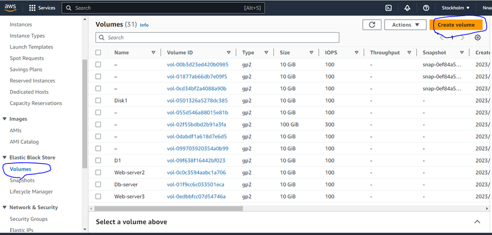
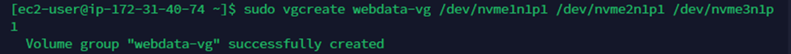
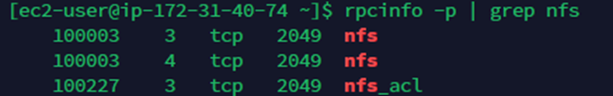
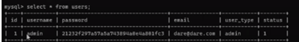
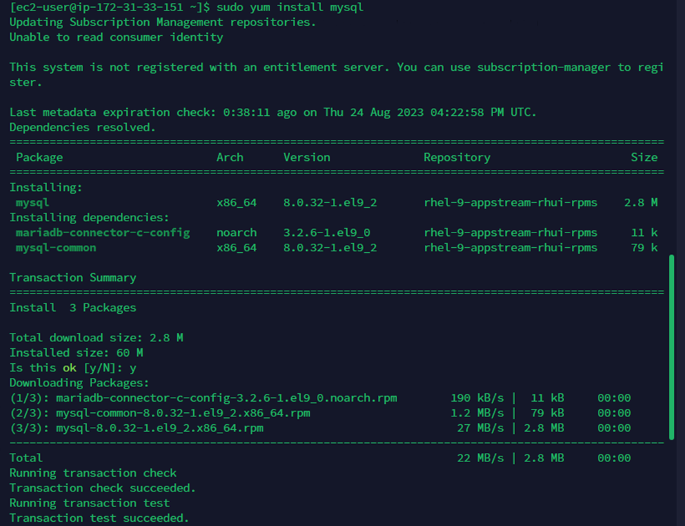

Projects7: 
•	Projects

•	Docs

•	(STEP 17) PROJECT 7: Devops Tooling Website Solution
DEVOPS TOOLING WEBSITE SOLUTION.
In previous [Project 6(https://www.dareyio.com/docs/project-6-step-1/) you implemented a WordPress based solution that is ready to be filled with content and can be used as a full fledged website or blog. Moving further we will add some more value to our solutions that your DevOps team could utilize. We want to introduce a set of DevOps tools that will help our team in day to day activities in managing, developing, testing, deploying and monitoring different projects.
The tools we want our team to be able to use are well known and widely used by multiple DevOps teams, so we will introduce a single DevOps Tooling Solution that will consist of:
1.	Jenkins – free and open source automation server used to build CI/CD pipelines.
2.	Kubernetes – an open-source container-orchestration system for automating computer application deployment, scaling, and management.
3.	Jfrog Artifactory – Universal Repository Manager supporting all major packaging formats, build tools and CI servers. Artifactory.
4.	Rancher – an open source software platform that enables organizations to run and manage Docker and Kubernetes in production.
5.	Grafana – a multi-platform open source analytics and interactive visualization web application.
6.	Prometheus – An open-source monitoring system with a dimensional data model, flexible query language, efficient time series database and modern alerting approach.
7.	Kibana – Kibana is a free and open user interface that lets you visualize your Elasticsearch data and navigate the Elastic Stack.
Note: Do not feel overwhelmed by all the tools and technologies listed above, we will gradually get ourselves familiar with them in upcoming projects!
Side Self Study
Read about Network-attached storage (NAS), Storage Area Network (SAN) and related protocols like NFS, (s)FTP, SMB, iSCSI. Explore what Block-level storage is and how it is used by Cloud Service providers, know the difference from Object storage.
On the example of AWS services understand the difference between Block Storage, Object Storage and Network File System.
Setup and technologies used in Project 7
As a member of a DevOps team, you will implement a tooling website solution which makes access to DevOps tools within the corporate infrastructure easily accessible.
In this project you will implement a solution that consists of following components:
1.	Infrastructure: AWS
2.	Webserver Linux: Red Hat Enterprise Linux 8
3.	Database Server: Ubuntu 20.04 + MySQL
4.	Storage Server: Red Hat Enterprise Linux 8 + NFS Server
5.	Programming Language: PHP
6.	Code Repository: GitHub.
        For Rhel 8 server use this ami RHEL-8.6.0_HVM-20220503-x86_64-2-Hourly2-GP2      (ami-035c5dc086849b5de)

On the diagram below you can see a common pattern where several stateless Web Servers share a common database and also access the same files using Network File Sytem (NFS) as a shared file storage. Even though the NFS server might be located on a completely separate hardware – for Web Servers it look like a local file system from where they can serve the same files.
On the diagram below you can see a common pattern where several stateless Web Servers share a common database and also access the same files using Network File Sytem (NFS) as a shared file storage. Even though the NFS server might be located on a completely separate hardware – for Web Servers it look like a local file system from where they can serve the same files.

It is important to know what storage solution is suitable for what use cases, for this – you need to answer following questions: what data will be stored, in what format, how this data will be accessed, by whom, from where, how frequently, etc. Base on this you will be able to choose the right storage system for your solution.
Instructions On How To Submit Your Work For Review And Feedback
To submit your work for review and feedback – follow this instruction.
Projects
•	Projects
•  Docs 
•	(STEP 17) PROJECT 7: Devops Tooling Website Solution
Step 1 – Prepare NFS Server
Step 1 – Prepare NFS Server
1.	Spin up a new EC2 instance with RHEL Linux 8 Operating System.
Below are the 5 instances launched, 4 Redhat instances that I created for 3 webservers, 1 Db server and 1 Ubuntu storage server. I also created volume and attach 10g with an availability zone of eu-north-1b.

Whichever terminal tools you wish to connect, you can connect. I usually connect to terminus terminal: 

On my command prompt, to check the device created and the attached volume, you run command list block to check.

Lsblk:

So, we do lsblk again to check if we have created the partition successfully. You will see below created partition.

For sudo gdisk /dev/nvme2n1

For sudo gdisk /dev/nvme3n1

So, when you run the list block command you will see all the created partions from the disk.
Sudo lsblk

Now the next thing we will do is to install the LVM package
Sudo yum install lvm2 –y

To check the available partitions, run sudo lvmdiskscan

To create physical volume

Command to check for physical volume
Sudo pvs

So, the group the disk volume created together into one physical volume, we will make use of the command below 

To check the volume group that has been combined together. Note that the file system and device make use of some Gigs, hence 29.99g

So, go back to our documentations. We are going to create logical volumes ie creating Lv logs and Lv apps. We just assigned 9gig to it.

sudo lvcreate –n apps-lv –L 9G webdata-vg
Logical volume “apps-lv” created
[ec2-user@ip-172-31-40-74 ]$ sudo lvcreate –n logs-lv –L 9G webdata-vg
Logical volume “logs-lv” created
We just want to create opt now but we will not mount it now as we will use it on project8 not in project7.

To see the logical volume created you do the command
Sudo lvs

So, we have successfully attached to one of those 10g, webdata-vg and partition that we created before

We can verify the entire command using this command below:
sudo vgdisplay -v #view complete setup - VG, PV, and LV
sudo vgdisplay –v #view complete setup –VG, PV, and LV
 
•	Instead of formating the disks as ext4 you will have to format them as xfs.
•	So, to format the disk as xfs, we will run command below.
•	First of all, we will need to mkfs

sudo mkfs –t xfs /dev/webdata-vg/apps-lv

So, to create mnt (mount points), following our documentation.
Sudo mkdir /mnt/apps
Sudo mkdir /mnt/logs
Sudo mkdir /mnt/opt

To mount to mnt

The next step is to install nfs server.

sudo systemctl start nfs-server.service
sudo systemctl enable nfs-server.service
sudo systemctl status nfs-server.service

sudo chown -R nobody: /mnt/apps:Ie changing the ownership

sudo chmod -R 777 /mnt/apps ie modifying

Configure access to NFS for clients within the same subnet (example of Subnet CIDR – 172.31.32.0/20 )
sudo vi /etc/exports

/mnt/apps <Subnet-CIDR>(rw,sync,no_all_squash,no_root_squash)
/mnt/logs <Subnet-CIDR>(rw,sync,no_all_squash,no_root_squash)
/mnt/opt <Subnet-CIDR>(rw,sync,no_all_squash,no_root_squash)

Esc + :wq!

sudo exportfs -arv

	Check which port is used by NFS and open it using Security Groups (add new Inbound Rule)
rpcinfo -p | grep nfs

Important note: In order for NFS server to be accessible from your client, you must also open following ports: TCP 111, UDP 111, UDP 2049

On the database server:
Sudo apt update

sudo mysql;

create database tooling;

create user 'webaccess'@'172.31.32.0/20' identified by 'password';

grant all privileges on tooling.* to 'webaccess'@'172.31.32.0/20';

flush privileges;

show databases;

use tooling;

select * from users;

sudo apt install mysql-server -y
Then, R_WEB1: Which is Webserver1. Connect to the terminal:
Step 3 — Prepare the Web Servers
We need to make sure that our Web Servers can serve the same content from shared storage solutions, in our case – NFS Server and MySQL database.
You already know that one DB can be accessed for reads and writes by multiple clients. For storing shared files that our Web Servers will use – we will utilize NFS and mount previously created Logical Volume lv-apps to the folder where Apache stores files to be served to the users (/var/www).
This approach will make our Web Servers stateless, which means we will be able to add new ones or remove them whenever we need, and the integrity of the data (in the database and on NFS) will be preserved.
During the next steps we will do following:
So, lets install NFS client because without the client to the webserver1, you will not be able to access NFS server.

sudo yum install nfs-utils nfs4-acl-tools -y

3.	Mount /var/www/ and target the NFS server’s export for apps:
4.	sudo mkdir /var/www

So, you copy the private IP address for NFS.
sudo mount –t nfs –o rw,nosuid 172.31.40.74:/mnt/apps /var/www
df-h

The circled is the NFS server.Also note that /mnt/apps is in the NFS server.
sudo touch /var/www/test.md
So, when I go to the NFS server and do ls /mnt/apps I will see this test.md that I created on the R_WEB1. See snapshot below on the NFS server.
ls /mnt/apps

So, whatever I created on the R_WEB1 has automatically been populated on the NFS server.

SO, LETS GO BACK TO R_WEBSERVER1 AND FOLLOW OUR DOCUMENTATION.

4.	Verify that NFS was mounted successfully by running df -h. Make sure that the changes will persist on Web Server after reboot:
sudo vi /etc/fstab

Then, install APACHE or NGINX because without Apache or Nginx our webserver will not be able to server content to our web users. They are not the only webservers but they are the most populous ones.

sudo yum install httpd -y
httpd is the folder for apache

Ls /var/www

The cgi-bin html was created when apache was installed.

Also when you check the cgi-bin html on the NFS, you will see it because whatever is in R_WEB1 is also duplicated in the NFS. See below snapshot.

ls /mnt/apps

Sudo mount –t nfs –o rw,nosuid 172.31.40.74:/mnt/logs /var/log/httpd

This is the log folder for apache and is located under httpd

So, we may need to go back and do this step4
4.	Verify that NFS was mounted successfully by running df -h. Make sure that the changes will persist on Web Server after reboot:
sudo vi /etc/fstab

Fork the tooling source code from Darey.io Github Account to your Github account. (Learn how to fork a repo here). For instance for you to fork URL using Darey.io Github Account as an example, then click on darey-io/tooling, then click on code and cppy the URL.

Then, first of all install git in your R_WEB1 server
Sudo yum install git –y
Sudo yum install git 

git init

sudo cp -R html/. /var/www/html( This means to copy recursively all the content on html folder to directory /var/www/html. sudo cp -R html/. 
 /var/www/html
ls html

So, now that we have all the files in the html folder lets go to our R_WEB1 and open port 80 in the security group from the instance.So, you can see it almost shares the same security group with NFS server.

So, we now added http to the R_WEB1 and save 

So, from the output, it means that the apache is not working and active

So, I had to run ble commands

sudo setenforce 0
sudo vi /etc/sysconfig/selinux

That is using vi editor to change the enforcing to disabled as circled above.

sudo vi /var/www/html/functions.php
Then edit it to below output

Then install mysql
Sudo yum install mysql

mysql -h <databse-private-ip> -u <db-username> -p <db-pasword> < to
sudo vi /etc/mysql/mysql.conf.d/mysql.cnf
Also remember to run this address on the DB Ubuntu server.

Remember to change the bind address to 0.0.0.0
Then restart mysql by running below command.
Sudo systemctl restart mysql
Sudo systemctl status mysql

Sudo mysql:

If you make mistake of not putting ; just do control c
 mysql –h 172.31.32.74 –u webaccess –p tooling <tooling-db.sq

Enter password:
Once it prompted password after running this command and you input the password it and it thro no error that means it worked.
No error, that means it worked.

Then, lets go back to our Db Ubuntu server:
ls 
Tooling
 cd tooling

Then changed to Db_serveru
sudo systemctl status mysql

mysql -h 172.31.32.74 -u webaccess -p tooling < tooling-db.sql

Type 'help;' or '\h' for help. Type '\c' to clear the current input statement.

mysql> create database tooling;
Query OK, 1 row affected (0.01 sec)
CREATE USER 'webaccess'@'172.31.33.151' IDENTIFIED WITH mysql_native_password BY '12 3456789'; The Ip address 172.31.33.151 is the webserver private Ip address

mysql> CREATE USER 'webaccess'@'172.31.33.151' IDENTIFIED WITH mysql_native_password BY '12 3456789';
Query OK, 0 rows affected (0.02 sec)

mysql> show databases;
+--------------------+
| Database           |
+--------------------+
| information_schema |
| mysql              |
| performance_schema |
| sys                
| tooling            |
+--------------------+
5 rows in set (0.00 sec)

mysql> use tooling;
Database changed

[ec2-user@ip-172-31-33-151 ~]$ ls
tooling
[ec2-user@ip-172-31-33-151 ~]$ sudo setenforce 0
setenforce: SELinux is disabled
[ec2-user@ip-172-31-33-151 ~]$ sudo vi /etc/sysconfig/selinux
[ec2-user@ip-172-31-33-151 ~]$ sudo systemctl start httpd
[ec2-user@ip-172-31-33-151 ~]$ sudo systemctl status httpd
● httpd.service - The Apache HTTP Server
     Loaded: loaded (/usr/lib/systemd/system/httpd.service; disabled; preset: disabled)
     Active: active (running) since Thu 2023-09-07 13:23:50 UTC; 20s ago
       Docs: man:httpd.service(8)
   Main PID: 1684 (httpd)
     Status: "Total requests: 0; Idle/Busy workers 100/0;Requests/sec: 0; Bytes served/sec:   0 B/sec"
      Tasks: 213 (limit: 4260)
     Memory: 36.2M
        CPU: 88ms
     CGroup: /system.slice/httpd.service
             ├─1684 /usr/sbin/httpd -DFOREGROUND
             ├─1685 /usr/sbin/httpd -DFOREGROUND
             ├─1686 /usr/sbin/httpd -DFOREGROUND
             ├─1687 /usr/sbin/httpd -DFOREGROUND
             └─1688 /usr/sbin/httpd -DFOREGROUND

Sep 07 13:23:50 ip-172-31-33-151.eu-north-1.compute.internal systemd[1]: Starting The Apache HTTP Server...
Sep 07 13:23:50 ip-172-31-33-151.eu-north-1.compute.internal systemd[1]: Started The Apache HTTP Server.
Sep 07 13:23:50 ip-172-31-33-151.eu-north-1.compute.internal httpd[1684]: Server configured, listening on: port 80
[ec2-user@ip-172-31-33-151 ~]$ ls
tooling
[ec2-user@ip-172-31-33-151 ~]$ cd tooling
[ec2-user@ip-172-31-33-151 tooling]$ mysql -h 172.31.32.74 -u webaccess -p tooling < tooling-db.sql
Enter password:
[ec2-user@ip-172-31-33-151 tooling]$ mysql -h 172.31.32.74 -u webaccess -p tooling < tooling-db.sql
| tooling            |
+--------------------+
5 rows in set (0.00 sec)

mysql> use tooling;
Database changed

[ec2-user@ip-172-31-33-151 ~]$ ls
tooling
[ec2-user@ip-172-31-33-151 ~]$ sudo setenforce 0
setenforce: SELinux is disabled
[ec2-user@ip-172-31-33-151 ~]$ sudo vi /etc/sysconfig/selinux
[ec2-user@ip-172-31-33-151 ~]$ sudo systemctl start httpd
[ec2-user@ip-172-31-33-151 ~]$ sudo systemctl status httpd
● httpd.service - The Apache HTTP Server
     Loaded: loaded (/usr/lib/systemd/system/httpd.service; disabled; preset: disabled)
     Active: active (running) since Thu 2023-09-07 13:23:50 UTC; 20s ago
       Docs: man:httpd.service(8)
   Main PID: 1684 (httpd)
     Status: "Total requests: 0; Idle/Busy workers 100/0;Requests/sec: 0; Bytes served/sec:   0 B/sec"
      Tasks: 213 (limit: 4260)
     Memory: 36.2M
        CPU: 88ms
     CGroup: /system.slice/httpd.service
             ├─1684 /usr/sbin/httpd -DFOREGROUND
             ├─1685 /usr/sbin/httpd -DFOREGROUND
             ├─1686 /usr/sbin/httpd -DFOREGROUND
             ├─1687 /usr/sbin/httpd -DFOREGROUND
             └─1688 /usr/sbin/httpd -DFOREGROUND

Sep 07 13:23:50 ip-172-31-33-151.eu-north-1.compute.internal systemd[1]: Starting The Apache HTTP Server...
Sep 07 13:23:50 ip-172-31-33-151.eu-north-1.compute.internal systemd[1]: Started The Apache HTTP Server.
Sep 07 13:23:50 ip-172-31-33-151.eu-north-1.compute.internal httpd[1684]: Server configured, listening on: port 80
[ec2-user@ip-172-31-33-151 ~]$ ls
tooling
[ec2-user@ip-172-31-33-151 ~]$ cd tooling
[ec2-user@ip-172-31-33-151 tooling]$ mysql -h 172.31.32.74 -u webaccess -p tooling < tooling-db.sql
Enter password:
[ec2-user@ip-172-31-33-151 tooling]$ mysql -h 172.31.32.74 -u webaccess -p tooling < tooling-db.sql

To run them independently use below commands

[ec2-user@ip-172-31-33-151 tooling]$ sudo systemctl restart httpd

So, if I put the username/admin and the password may be from the mysql user output, we will get below.

Open the website in your browser http://<Web-Server-Public-IP-Address-or-Public-DNS-Name>/index.php and make sure you can login into the website with myuser user.

